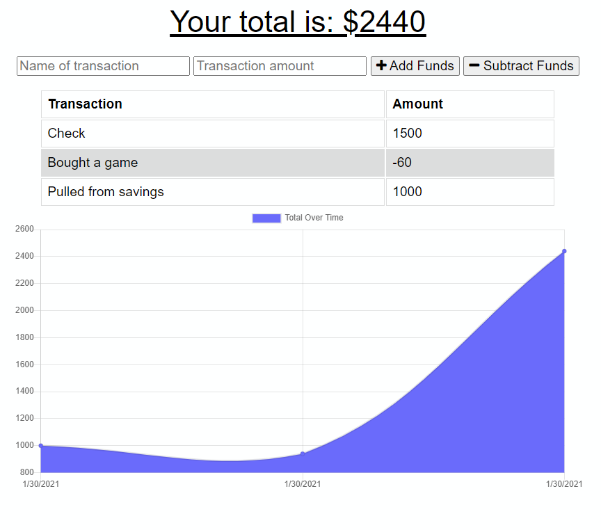

# Offline Budget Tracker

## Description
This is a budget tracker. You can navigate to the web page and add transactions. If you want to go offline, you also have that option, as soon as you reconnect to the internet your transactions will move out of the temporary storage and into the live database

[Live Demo](https://your-offline-budget-tracker.herokuapp.com/)
[Github URL](https://github.com/HeavensRegent/nb-w18-homework)

## Table of Contents
* [Installation Instructions](<#installation-instructions>)
* [Usage Information](<#usage-information>)
* [Collaborators](<#collaborators>)
* [Contribution Guidelines](<#contribution-guidelines>)
* [Test Instructions](<#test-instructions>)
* [License](<#license>)
* [Questions](<#questions>)

## Installation Instructions
npm i;

## Usage Information
To run the project run `npm start`

## Collaborators
[https://github.com/HeavensRegent](https://github.com/HeavensRegent)

## Contribution Guidelines
Forking and pull requests

## Test Instructions
None

## License
MIT License

## Questions
View my Github Profile at [https://github.com/HeavensRegent](https://github.com/HeavensRegent)

Contact me at blstarwars1@gmail.com
